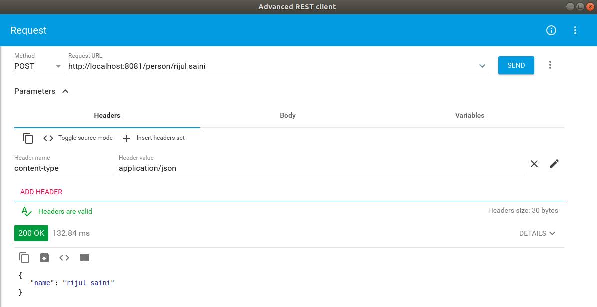

=== Creating RESTful Web Services in Spring

Previously, we used CRUD repository objects for each data type of the domain model and implemented use-cases in service classes. In this section, we will Implement REST API for eventregistration (people, events and registrations) and expose Sping Data.

If you would like to, you can obtain a version of the project that already has the changes from the previous tutorials link:https://github.com/McGill-ECSE321-Winter2019/eventregistration[here].

==== Preliminaries

. Set database URL to start application and accessing the database remotey. You can do the same by either adding an environment variable called `SPRING_DATASOURCE_URL` or by specifying `spring.datasource.url`, `spring.datasource.username`, and `spring.datasource.password` in _src/main/resources/application.properties_.

. Add the dependency 'spring-boot-starter-data-rest' in _build.gradle_ file of your backend. It is required to expose Spring Data repositories over REST using Spring Data REST.
+
[source,gradle]
----
implementation 'org.springframework.boot:spring-boot-starter-data-rest'
implementation 'org.springframework.boot:spring-boot-starter-data-jpa'
implementation 'org.springframework.boot:spring-boot-starter-web'

runtimeOnly 'org.postgresql:postgresql'
testImplementation 'org.springframework.boot:spring-boot-starter-test'
----

==== Building a RESTful Web Service

We will discuss two ways to build RESTful web service for our Spring Boot project.

===== Building a RESTful Web Service Using Controller and DTOs

. We will first create a new package in EventRegistration-Backend and then create EventRegistrationRestController class inside it. We have added the annotation `@RestController` 
above the controller class so that HTTP requests are handled by EventRegistrationRestController. In addition, we enabled the Cross-Origin Resource Sharing at the controller level using '@CrossOrigin' notation.
+
[source,java]
----
package ca.mcgill.ecse321.eventregistration.controller;

@CrossOrigin(origins = "*")
@RestController
public class EventRegistrationRestController {
}
----

. We further create another package ca.mcgill.ecse321.eventregistration.dto and create the below files inside that package. First we create EventDto.java.
+
[source,java]
----
package ca.mcgill.ecse321.eventregistration.dto;

import java.sql.Date;
import java.sql.Time;

public class EventDto {

	private String name;
	private Date eventDate;
	private Time startTime;
	private Time endTime;

	public EventDto() {
	}

	public EventDto(String name) {
		this(name, Date.valueOf("1971-01-01"), Time.valueOf("00:00:00"), Time.valueOf("23:59:59"));
	}

	public EventDto(String name, Date eventDate, Time startTime, Time endTime) {
		this.name = name;
		this.eventDate = eventDate;
		this.startTime = startTime;
		this.endTime = endTime;
	}

	public String getName() {
		return name;
	}

	public Date getEventDate() {
		return eventDate;
	}

	public Time getStartTime() {
		return startTime;
	}

	public Time getEndTime() {
		return endTime;
	}

}
----

. Next, we create `PersonDto` Java class.
+
[source,java]
----
package ca.mcgill.ecse321.eventregistration.dto;

import java.util.Collections;
import java.util.List;

public class PersonDto {

	private String name;
	private List<EventDto> events;

	public PersonDto() {
	}

	@SuppressWarnings("unchecked")
	public PersonDto(String name) {
		this(name, Collections.EMPTY_LIST);
	}

	public PersonDto(String name, List<EventDto> arrayList) {
		this.name = name;
		this.events = arrayList;
	}

	public String getName() {
		return name;
	}

	public List<EventDto> getEvents() {
		return events;
	}

	public void setEvents(List<EventDto> events) {
		this.events = events;
	}

}
----

. Finally, we create `RegistrationDto` Java class.
+
[source,java]
----
package ca.mcgill.ecse321.eventregistration.dto;

public class RegistrationDto {

	private PersonDto person;
	private EventDto event;
	
	public RegistrationDto() {
	}

	public RegistrationDto(PersonDto person, EventDto event) {
		this.person = person;
		this.event = event;
	}
	
	public PersonDto getperson() {
		return person;
	}
	
	public void setperson(PersonDto person) {
		this.person = person;
	}

	public EventDto getEvent() {
		return event;
	}

	public void setEvent(EventDto event) {
		this.event = event;
	}
}
----

. Now, we will add the methods in the controller class. Also, we will add annotaions to map web requests.
+
[source,java]
----
	@PostMapping(value = { "/persons/{name}", "/persons/{name}/" })
	public PersonDto createPerson(@PathVariable("name") String name) throws IllegalArgumentException {
		// @formatter:on
		Person person = service.createPerson(name);
		return convertToDto(person);
	}
----

@RequestMapping annotation is used to map web requests to Spring Controller methods. Since, @RequestMapping maps all HTTP operations by default. We can use @GetMapping, @PostMapping and so forth to narrow this mapping.

Moreover, in the above snippet, we use "value" and @PathVariable to bind the value of the query string parameter name into the name parameter of the createPerson() method.

. You can add other methods similarly with appropriate mappings.
+
[source,java]
----
@PostMapping(value = { "/events/{name}", "/events/{name}/" })
public EventDto createEvent(@PathVariable("name") String name, @RequestParam Date date,
@RequestParam @DateTimeFormat(iso = DateTimeFormat.ISO.TIME, pattern = "HH:mm") LocalTime startTime,
@RequestParam @DateTimeFormat(iso = DateTimeFormat.ISO.TIME, pattern = "HH:mm") LocalTime endTime)
throws IllegalArgumentException {
	Event event = service.createEvent(name, date, Time.valueOf(startTime), Time.valueOf(endTime));
	return convertToDto(event);
}

@GetMapping(value = { "/events", "/events/" })
public List<EventDto> getAllEvents() {
	List<EventDto> eventDtos = new ArrayList<>();
	for (Event event : service.getAllEvents()) {
		eventDtos.add(convertToDto(event));
	}
	return eventDtos;
}

@PostMapping(value = { "/register", "/register/" })
public RegistrationDto registerPersonForEvent(@RequestParam(name = "person") PersonDto pDto,
	@RequestParam(name = "event") EventDto eDto) throws IllegalArgumentException {
	Person p = service.getPerson(pDto.getName());
	Event e = service.getEvent(eDto.getName());

	Registration r = service.register(p, e);
	return convertToDto(r, p, e);
}

@GetMapping(value = { "/registrations/person/{name}", "/registrations/person/{name}/" })
public List<EventDto> getEventsOfPerson(@PathVariable("name") PersonDto pDto) {
	Person p = convertToDomainObject(pDto);
	return createEventDtosForPerson(p);
}

@GetMapping(value = { "/events/{name}", "/events/{name}/" })
public EventDto getEventByName(@PathVariable("name") String name) throws IllegalArgumentException {
	return convertToDto(service.getEvent(name));
}

private EventDto convertToDto(Event e) {
	if (e == null) {
		throw new IllegalArgumentException("There is no such Event!");
	}
	EventDto eventDto = new EventDto(e.getName(),e.getDate(),e.getStartTime(),e.getEndTime());
	return eventDto;
}

private PersonDto convertToDto(Person p) {
	if (p == null) {
		throw new IllegalArgumentException("There is no such Person!");
	}
	PersonDto personDto = new PersonDto(p.getName());
	personDto.setEvents(createEventDtosForPerson(p));
	return personDto;
}

private RegistrationDto convertToDto(Registration r, Person p, Event e) {
	EventDto eDto = convertToDto(e);
	PersonDto pDto = convertToDto(p);
	return new RegistrationDto(pDto, eDto);
}

private Person convertToDomainObject(PersonDto pDto) {
	List<Person> allPersons = service.getAllPersons();
	for (Person person : allPersons) {
		if (person.getName().equals(pDto.getName())) {
			return person;
		}
	}
	return null;
}

private List<EventDto> createEventDtosForPerson(Person p) {
	List<Event> eventsForPerson = service.getEventsAttendedByPerson(p);
	List<EventDto> events = new ArrayList<>();
	for (Event event : eventsForPerson) {
		events.add(convertToDto(event));
	}
	return events;
}
----

==== Test the Service

We can test the application using, e.g., the RESTClient browser plugin, Advanced Rest Client, Postman or curl.

Once you launch the client, you can specify the path and select the method as shown in the below figures.

Once we use POST, the record is persisted and then we can use the GET method to retrive the same.

image:figs/RestClient2.png[GET method on REST Client,width=1000]

Similary, we can test the other methods.

==== Spring Data - an Alternative to Exposing the Database
The advantage of using Spring Data Rest is that it can remove a lot of boilerplate that’s natural to REST services. Spring would automatically create endpoints like /events, /people as we saw above and these endpoints can be further customized.

. We have already added the dependency 'spring-boot-starter-data-rest' in preliminary section to to expose Spring Data repositories over REST using Spring Data REST.

. Next, we can go to repository interfaces and add @RepositoryRestResource annotaion.
+
[source,java]
----
@RepositoryRestResource(collectionResourceRel = "participants", path = "participants")
public interface PersonRepository extends CrudRepository<Person, String>{
	
	Person findPersonByName(String name);
	
}
----

. Finally, we can access this REST API in the browser or REST Client and will receive the JSON as shown below.

image:figs/RestClient3.png[Post method on REST Client,width=1000]
