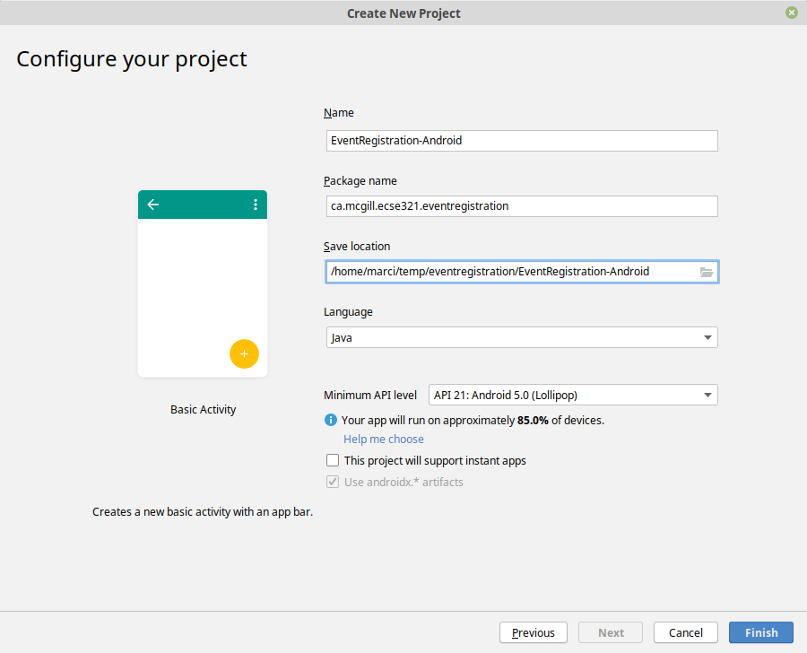

=== Setting up your repository

. Navigate to the directory where the EventRegistration application resides, e.g., _/home/user/git/eventregistration_

. Initialize a new, orphan branch with the following commands

```bash
git checkout --orphan android
git reset
rm ./* .gitignore
```
[NOTE]
One-liner command that does the same for those who like living dangerously: +
`git checkout --orphan android && git reset && rm ./* .gitignore`

=== Create an Android project

. Start a new Android project


. Select a *Basic Activity* and click *Next*
+


. Specify project details and click on *Finish*
* Application name: *EventRegistration-Android*
* Package name: `ca.mcgill.ecse321.eventregistration`
* Project location: create the project within the prepared working copy of the git repository say, _/home/user/git/eventregistration/EventRegistration-Android_`)
* Select _Java_ as language
* Click on *Finish* 
+


. Wait until the project is built by Gradle, this takes a minute or two

. Optional step.
[TIP]
Optionally, to setup version control integration, go to _File/Settings.../Version Control_ and add the repository as Git root to the project settings +
 +
Then, you can issue Git commands from the _VCS_ menu in Android Studio while developing the application. Regardless whether you complete this step or not, you can still use git from the command line, since the project is created in the working directory of your git repository.

. Select the *Project* view in the left pane (instead of the default *Android* view) and
observe three files:
+
image:figs/Android-SelectProjectView.png[Project view]

* **MainActivity.java**: application code is written here (located in
  **app/src/main/java**)
* **content_main.xml**: layout specifications of the UI are provided in XML
(located in _app/src/main/res/layout_)
* **strings.xml**: naming of resources
(located in _app/src/main/res/values_)

. Include a dependency for network communication by adding the following line to the `build.gradle` file located in the _app_
folder to the end within the `dependencies{ ... }` part (see figure, but the content is different).
+
[source,gradle]
----
    implementation 'com.loopj.android:android-async-http:1.4.9'
----

. Open the **AndroidManifest.xml** file (located in `app/src/main` within the Android project), and add the following XML tag for setting permissions appropriately (before the existing `<application>` tag)
+
[source,xml]
----
<?xml version="1.0" encoding="utf-8"?>
<manifest xmlns:android="http://schemas.android.com/apk/res/android"
    package="ca.mcgill.ecse321.eventregistration">
    
    <uses-permission android:name="android.permission.INTERNET"/>
    <!-- Existing content with <application> tag -->
</manifest>
----

. As the gradle build file has changed, click on the *Sync* link.

. Re-build the project by **Build | Make Project**  if still needed.
