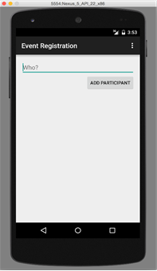
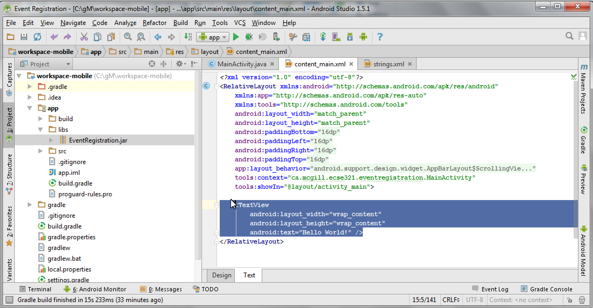
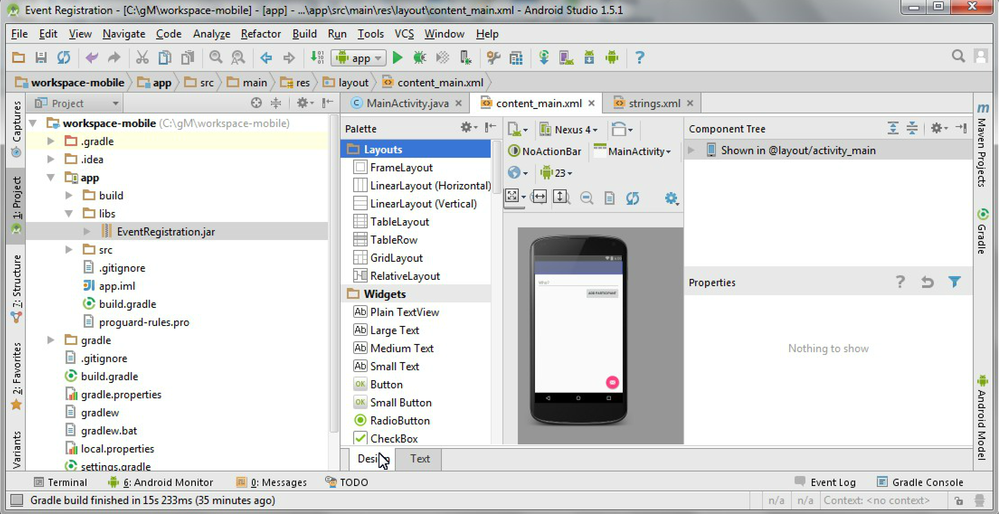

=== Developing for Android: Part 1
:experimental:

==== Developing the View Layout

In the next steps, we will develop a simple GUI as the view for the mobile
EventRegistration app with (1) one text field for specifying the name of a person, 
and (2) one **Add Person** button

The GUI will look like as depicted below. +


. Open the **content_main.xml** file, which contains a default **Hello World**
text.

. Replace the highlighted default content with the following XML tags. +
 +
[source,xml]
----
<LinearLayout
    android:layout_width="match_parent"
    android:layout_height="wrap_content"
    android:orientation="vertical"
    app:layout_constraintLeft_toLeftOf="parent"
    app:layout_constraintRight_toRightOf="parent"
    app:layout_constraintTop_toTopOf="parent">
    
    <TextView
            android:id="@+id/error"
            android:layout_height="wrap_content"
            android:layout_width="wrap_content"
            android:visibility="gone"
            android:text=""
            android:textColor="@color/colorAccent"/>

    <EditText
        android:layout_width="match_parent"
        android:layout_height="wrap_content"
        android:id="@+id/newperson_name"
        android:hint="@string/newperson_hint"/>

    <Button
        android:layout_width="wrap_content"
        android:layout_height="wrap_content"
        android:layout_gravity="end"
        android:text="@string/newperson_button"
        android:onClick="addPerson"/>
</LinearLayout>
----

** **LinearLayout** declares a vertical layout to hold the GUI elements;
** **EditText** adds a textfield to enter the name of the person;
** **Button** provides a button to add a person.
+
Some erroneous tags are marked in red, which will be corrected in the following
steps.

===== Specifying a text field and a button

. We place new literals in the *strings.xml* 
+
```xml
<string name="newperson_hint">Who?</string>
<string name="newperson_button">Add Person</string>
```
. Save *strings.xml*

===== Observing the view

. Save the file *content_main.xml*.

. Click on the **Design** tab to check the graphical preview of the app.
+


==== Connecting to backend via RESTful service calls

As a next step, we define a view depicted below and add Java code to provide behavior for the view, e.g. what
should happen when the different buttons are clicked.
The key interactions of our application are the following:

a.	What to do when the application is launched? (`onCreate()`)
a.	What to do when a button is clicked? (`addPerson()`)

===== Create a utility class for communicating with HTTP messages

. Make sure you have the `implementation 'com.loopj.android:android-async-http:1.4.9'` dependency (among others) in the `build.gradle` file for the `app` module (see the section on project setup for more details)

. Create the `HttpUtils` class in the `ca.mcgill.ecse321.eventregistration` package and add missing imports as required with kbd:[Alt+Enter]
+
[TIP]
You may need to wait a few minutes after dependencies have been resolved to allow the IDE to index classes
+
[source,java]
----
public class HttpUtils {
    public static final String DEFAULT_BASE_URL = "https://eventregistration-backend-123.herokuapp.com/";

    private static String baseUrl;
    private static AsyncHttpClient client = new AsyncHttpClient();

    static {
        baseUrl = DEFAULT_BASE_URL;
    }

    public static String getBaseUrl() {
        return baseUrl;
    }

    public static void setBaseUrl(String baseUrl) {
        HttpUtils.baseUrl = baseUrl;
    }

    public static void get(String url, RequestParams params, AsyncHttpResponseHandler responseHandler) {
        client.get(getAbsoluteUrl(url), params, responseHandler);
    }

    public static void post(String url, RequestParams params, AsyncHttpResponseHandler responseHandler) {
        client.post(getAbsoluteUrl(url), params, responseHandler);
    }

    public static void getByUrl(String url, RequestParams params, AsyncHttpResponseHandler responseHandler) {
        client.get(url, params, responseHandler);
    }

    public static void postByUrl(String url, RequestParams params, AsyncHttpResponseHandler responseHandler) {
        client.post(url, params, responseHandler);
    }

    private static String getAbsoluteUrl(String relativeUrl) {
        return baseUrl + relativeUrl;
    }
}
----

===== Further helper methods 

. Open the **MainActivity.java** file.

. Add a new attribute to the beginning of the class for error handling.
+
[source,java]
----
// ...
public class MainActivity extends AppCompatActivity {
  private String error = null;

  // ...
}
----

. Implement the `refreshErrorMessage()` method to display the error message on the screen, if there is any.
+
[NOTE]
Again, add imports with kbd:[Alt+Enter] (import is needed for `TextView`)
+
[source,java]
----
private void refreshErrorMessage() {
  // set the error message
  TextView tvError = (TextView) findViewById(R.id.error);
  tvError.setText(error);

  if (error == null || error.length() == 0) {
    tvError.setVisibility(View.GONE);
  } else {
    tvError.setVisibility(View.VISIBLE);
  }
}
---- 

. Add code to initialize the application in the `onCreate()` method (after the auto-generated code).
+
[source,java]
----
@Override
protected void onCreate(Bundle savedInstanceState) {
  // ...
  // INSERT TO END OF THE METHOD AFTER AUTO-GENERATED CODE
  // initialize error message text view
  refreshErrorMessage();
}
----

===== Creating a handler for Add Person button

. Implement the `addPerson()` method as follows
+
[source,java]
----
public void addPerson(View v) {
  error = "";
  final TextView tv = (TextView) findViewById(R.id.newperson_name);
  HttpUtils.post("persons/" + tv.getText().toString(), new RequestParams(), new JsonHttpResponseHandler() {
      @Override
      public void onSuccess(int statusCode, Header[] headers, JSONObject response) {
          refreshErrorMessage();
          tv.setText("");
      }
      @Override
      public void onFailure(int statusCode, Header[] headers, Throwable throwable, JSONObject errorResponse) {
          try {
              error += errorResponse.get("message").toString();
          } catch (JSONException e) {
              error += e.getMessage();
          }
          refreshErrorMessage();
      }
  });
}
----

. Import the missing classes again with kbd:[Alt+Enter]. There are multiple `Header` classes available, you need to import the `cz.msebera.android.httpclient.Header` class.
