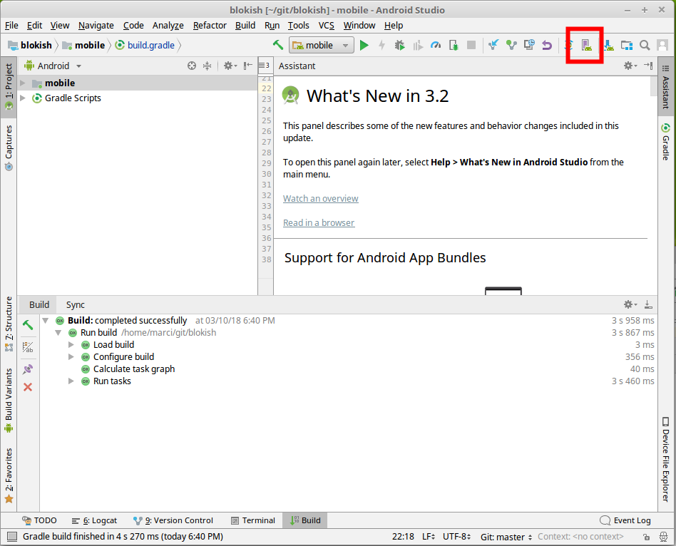
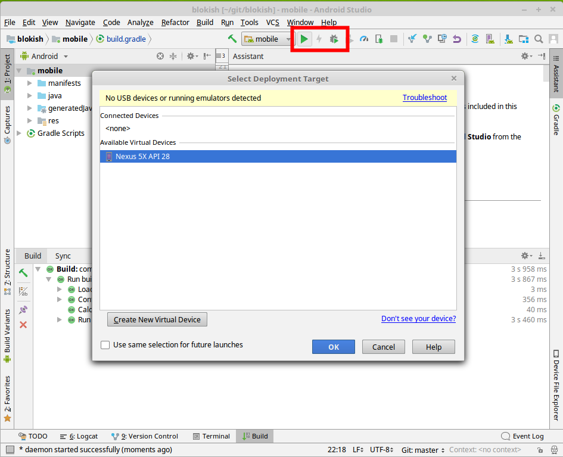

=== Running and Testing the Application on a Virtual Device
1. Start the Spring backend application on Heroku, while ensure that the `DEFAULT_BASE_URL` in `HttpUtils` is configured accordingly. +

1. Click on the _AVD manager_ button in Android Studio near the top right corner of the window
+

1. Add a new device with default settings.
+
[NOTE]
You might be asked to download emulator files. If this happens, click OK.

1. Start/Debug the application using the buttons highlighted on the figure below
+

1. After you select the device (in this case Nexus 5X) as deployment target, the application will automatically be deployed and started within an Android VM, and it is ready to use. Be patient, deployment and startup may take a few seconds.

1. Leave the text field empty, then try adding a person. You should get an error message on screen saying a person cannot be added with no name.

1. Supply a name for a new person, then try adding it. Upon successful completion, the text field and the error message should clear.
