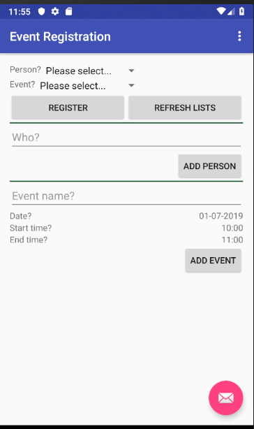

=== Developing for Android (Part 2) 
:experimental:

[NOTE]
You can use the https://eventregistration-backend-123.herokuapp.com backend URL for the event registration example in the `HttpUtils` class.

As a next step, we extend the view and its behavior. Key interactions of our application added in this phase are the following:

a.	What to do when the application is launched? (`onCreate()`)
a.	What to do when application data is updated? (`refreshLists()`)
a.	What to do when a button is clicked? (`addEvent()`, and `register()`)

The expected layout of the application:

==== Create helper classes  

. Create the classes included in the next two steps within the `ca.mcgill.ecse321.eventregistration` package

. Create a new class called `DatePickerFragment`
[NOTE]
Import missing classes with kbd:[Alt+Enter]. If the import option offers multiple classes, choose the ones that are not deprecated.
+
[source,java]
----
public class DatePickerFragment extends DialogFragment
        implements DatePickerDialog.OnDateSetListener {

    @Override
    public Dialog onCreateDialog(Bundle savedInstanceState) {
        // Use the current date as the default date in the picker
        final Calendar c = Calendar.getInstance();
        int year = c.get(Calendar.YEAR);
        int month = c.get(Calendar.MONTH);
        int day = c.get(Calendar.DAY_OF_MONTH);

        // Parse the existing time from the arguments
        Bundle args = getArguments();
        if (args != null) {
            year = args.getInt("year");
            month = args.getInt("month");
            day = args.getInt("day");
        }

        // Create a new instance of DatePickerDialog and return it
        return new DatePickerDialog(getActivity(), this, year, month, day);
    }

    public void onDateSet(DatePicker view, int year, int month, int day) {
        MainActivity myActivity = (MainActivity)getActivity();
        myActivity.setDate(getArguments().getInt("id"), day, month, year);
    }
}
----

. Create a new class called `TimePickerFragment`
[NOTE]
The method `setTime` is missing from the `MainActivity` class and will be added later (i.e., the error message which complains that this method is missing is normal)
+
[source,java]
----
public class TimePickerFragment extends DialogFragment
        implements TimePickerDialog.OnTimeSetListener {

    String label;

    @Override
    public Dialog onCreateDialog(Bundle savedInstanceState) {
        int hour = 0;
        int minute = 0;

        // Parse the existing time from the arguments
        Bundle args = getArguments();
        if (args != null) {
            hour = args.getInt("hour");
            minute = args.getInt("minute");
        }

        // Create a new instance of TimePickerDialog and return it
        return new TimePickerDialog(getActivity(), this, hour, minute,
                DateFormat.is24HourFormat(getActivity()));
    }

    public void onTimeSet(TimePicker view, int hourOfDay, int minute) {
        MainActivity myActivity = (MainActivity)getActivity();
        myActivity.setTime(getArguments().getInt("id"), hourOfDay, minute);
    }
}
----

. Add the following helper methods within the `MainActivity` class to support date and time pickers
+
[source,java]
----
private Bundle getTimeFromLabel(String text) {
    Bundle rtn = new Bundle();
    String comps[] = text.toString().split(":");
    int hour = 12;
    int minute = 0;

    if (comps.length == 2) {
        hour = Integer.parseInt(comps[0]);
        minute = Integer.parseInt(comps[1]);
    }

    rtn.putInt("hour", hour);
    rtn.putInt("minute", minute);

    return rtn;
}

private Bundle getDateFromLabel(String text) {
    Bundle rtn = new Bundle();
    String comps[] = text.toString().split("-");
    int day = 1;
    int month = 1;
    int year = 1;

    if (comps.length == 3) {
        day = Integer.parseInt(comps[0]);
        month = Integer.parseInt(comps[1]);
        year = Integer.parseInt(comps[2]);
    }

    rtn.putInt("day", day);
    rtn.putInt("month", month-1);
    rtn.putInt("year", year);

    return rtn;
}

public void showTimePickerDialog(View v) {
    TextView tf = (TextView) v;
    Bundle args = getTimeFromLabel(tf.getText().toString());
    args.putInt("id", v.getId());

    TimePickerFragment newFragment = new TimePickerFragment();
    newFragment.setArguments(args);
    newFragment.show(getSupportFragmentManager(), "timePicker");
}

public void showDatePickerDialog(View v) {
    TextView tf = (TextView) v;
    Bundle args = getDateFromLabel(tf.getText().toString());
    args.putInt("id", v.getId());

    DatePickerFragment newFragment = new DatePickerFragment();
    newFragment.setArguments(args);
    newFragment.show(getSupportFragmentManager(), "datePicker");
}

public void setTime(int id, int h, int m) {
    TextView tv = (TextView) findViewById(id);
    tv.setText(String.format("%02d:%02d", h, m));
}

public void setDate(int id, int d, int m, int y) {
    TextView tv = (TextView) findViewById(id);
    tv.setText(String.format("%02d-%02d-%04d", d, m + 1, y));
}
---- 

==== Update view definition

. The corresponding (but partly incomplete) view definition in the `content_main.xml` file is the following:
+
[source,xml]
----
<LinearLayout
    android:layout_height="wrap_content"
    android:layout_width="match_parent"
    android:orientation="vertical">
    <TextView
        android:id="@+id/error"
        android:layout_height="wrap_content"
        android:layout_width="wrap_content"
        android:visibility="gone"
        android:text=""
        android:textColor="@color/colorAccent"/>

    <LinearLayout
        android:layout_height="wrap_content"
        android:layout_width="match_parent"
        android:orientation="vertical">
        <LinearLayout
            android:layout_width="wrap_content"
            android:layout_height="match_parent"
            android:orientation="vertical">
            <LinearLayout
                android:orientation="horizontal"
                android:layout_height="wrap_content"
                android:layout_width="match_parent">
                <TextView
                    android:layout_height="wrap_content"
                    android:layout_width="wrap_content"
                    android:text="@string/personspinner_label"/>
                <Spinner
                    android:layout_height="wrap_content"
                    android:layout_width="wrap_content"
                    android:layout_gravity="end"
                    android:id="@+id/personspinner"/>
            </LinearLayout>
            <LinearLayout
                android:orientation="horizontal"
                android:layout_height="wrap_content"
                android:layout_width="match_parent">
                <TextView
                    android:layout_height="wrap_content"
                    android:layout_width="wrap_content"
                    android:text="@string/eventspinner_label"/>
                <Spinner
                    android:id="@+id/eventspinner"
                    android:layout_width="match_parent"
                    android:layout_height="wrap_content"
                    android:layout_gravity="end"
                    android:layout_margin="0dp"/>
            </LinearLayout>
        </LinearLayout>
        <!-- TODO add a Register and Refresh Lists buttons here -->
    </LinearLayout>

    <View
        android:layout_height="2dp"
        android:layout_width="fill_parent"
        android:background="#16552e"/>

    <LinearLayout
        android:orientation="vertical"
        android:layout_height="wrap_content"
        android:layout_width="match_parent">
        <EditText
            android:layout_width="match_parent"
            android:layout_height="wrap_content"
            android:id="@+id/newperson_name"
            android:hint="@string/newperson_hint"/>
        <Button
            android:layout_width="wrap_content"
            android:layout_height="wrap_content"
            android:layout_gravity="end"
            android:text="@string/newperson_button"
            android:onClick="addPerson"/>
    </LinearLayout>

    <View
        android:layout_height="2dp"
        android:layout_width="fill_parent"
        android:background="#16552e"/>

    <LinearLayout
        android:layout_width="match_parent"
        android:layout_height="wrap_content"
        android:orientation="vertical">
        <EditText android:id="@+id/newevent_name"
            android:layout_height="wrap_content"
            android:layout_width="fill_parent"
            android:hint="@string/newevent_hint"/>
        <LinearLayout
            android:orientation="horizontal"
            android:layout_height="wrap_content"
            android:layout_width="match_parent">
            <TextView
                android:layout_height="wrap_content"
                android:layout_width="0dp"
                android:layout_weight="1"
                android:text="@string/newevent_date_label"/>
            <TextView
                android:layout_height="wrap_content"
                android:layout_width="wrap_content"
                android:text="@string/newevent_date_first"
                android:layout_gravity="end"
                android:id="@+id/newevent_date"
                android:onClick="showDatePickerDialog"/>
        </LinearLayout>
        <LinearLayout
            android:orientation="horizontal"
            android:layout_height="wrap_content"
            android:layout_width="match_parent">
            <TextView
                android:layout_height="wrap_content"
                android:layout_width="0dp"
                android:layout_weight="1"
                android:text="@string/starttime_label"/>
            <TextView
                android:layout_height="wrap_content"
                android:layout_width="wrap_content"
                android:text="@string/starttime_first"
                android:layout_gravity="end"
                android:id="@+id/starttime"
                android:onClick="showTimePickerDialog"/>
        </LinearLayout>
        <!-- TODO add a label and a time picker for event end time -->
        <!-- TODO add Add Event button here -->
    </LinearLayout>
</LinearLayout>
----

. The missing string definitions go in the `res/values/strings.xml` resource
+
[source,xml]
----
<resources>
    <string name="app_name">EventRegistration-Android</string>
    <string name="action_settings">Settings</string>
    <string name="newperson_hint">Who?</string>
    <string name="newperson_button">Add Person</string>
    <string name="newevent_date_label">Date?</string>
    <string name="personspinner_label">Person?</string>
    <string name="eventspinner_label">Event?</string>
    <string name="starttime_label">Start time?</string>
    <string name="newevent_date_first">01-07-2019</string>
    <string name="starttime_first">10:00</string>
    <string name="newevent_hint">Event Name?</string>
</resources>
----

* *TODO*: add a _Register_ button to allow registering a selected person to a selected event (call the `register()` method when clicked - this is to be implemented in the upcoming steps)
* *TODO*: add a _Refresh Lists_ button that refreshes the contents of the event and person spinners (call the `refreshLists()` method when clicked)
* *TODO*: add a label with text _End?_ below the _Start?_ label
* *TODO*: add a time picker to select the end time of a new event
* *TODO*: add an _Add Event_ button to allow creating new events from the user interface (call the `addEvent()` method when clicked - this is to be implemented in the upcoming steps)

==== Initialization on application launch
. Open the **MainActivity.java** file.

. Add a few new attributes to the beginning of the class as helpers for persistence and error
handling.
+
[source,java]
----
public class MainActivity extends AppCompatActivity {
  private String error = null;
  // APPEND NEW CONTENT STARTING FROM HERE
  private List<String> personNames = new ArrayList<>();
  private ArrayAdapter<String> personAdapter;
  private List<String> eventNames = new ArrayList<>();
  private ArrayAdapter<String> eventAdapter;

  //...
}
----
* Import missing classes (e.g. use kbd:[Alt+Enter])

. Add code to initialize the application with data from the server in the `onCreate()` method (after the auto-generated code).
+
[source,java]
----
@Override
protected void onCreate(Bundle savedInstanceState) {
  // ...
  // INSERT TO END OF THE METHOD
  // Add adapters to spinner lists and refresh spinner content
  Spinner personSpinner = (Spinner) findViewById(R.id.personspinner);
  Spinner eventSpinner = (Spinner) findViewById(R.id.eventspinner);

  personAdapter = new ArrayAdapter<String>(this, android.R.layout.simple_spinner_item, personNames);
  personAdapter.setDropDownViewResource(android.R.layout.simple_spinner_dropdown_item);
  personSpinner.setAdapter(personAdapter);

  eventAdapter = new ArrayAdapter<String>(this, android.R.layout.simple_spinner_item, eventNames);
  eventAdapter.setDropDownViewResource(android.R.layout.simple_spinner_dropdown_item);
  eventSpinner.setAdapter(eventAdapter);

  // Get initial content for spinners
  refreshLists(this.getCurrentFocus());
}
----

////
super.onCreate(savedInstanceState);
setContentView(R.layout.activity_main);
Toolbar toolbar = (Toolbar) findViewById(R.id.toolbar);
setSupportActionBar(toolbar);

FloatingActionButton fab = (FloatingActionButton) findViewById(R.id.fab);
fab.setOnClickListener(new View.OnClickListener() {
    @Override
    public void onClick(View view) {
        Snackbar.make(view, "Replace with your own action", Snackbar.LENGTH_LONG)
                .setAction("Action", null).show();
    }
});
////

At this point the `refreshLists()` method is missing, this is to be implemented in the upcoming steps.

==== Reactions to updated data

. Create the missing new method `refreshLists()` which seeks for the event and person spinners and sets their content according to the data retrieved from the server
+
[source,java]
----
public void refreshLists(View view) {
    refreshList(personAdapter ,personNames, "people");
    refreshList(eventAdapter, eventNames, "events");
}

private void refreshList(final ArrayAdapter<String> adapter, final List<String> names, final String restFunctionName) {
    HttpUtils.get(restFunctionName, new RequestParams(), new JsonHttpResponseHandler() {

        @Override
        public void onSuccess(int statusCode, Header[] headers, JSONArray response) {
            names.clear();
            names.add("Please select...");
            for( int i = 0; i < response.length(); i++){
                try {
                    names.add(response.getJSONObject(i).getString("name"));
                } catch (Exception e) {
                    error += e.getMessage();
                }
                refreshErrorMessage();
            }
            adapter.notifyDataSetChanged();
        }

        @Override
        public void onFailure(int statusCode, Header[] headers, Throwable throwable, JSONObject errorResponse) {
            try {
                error += errorResponse.get("message").toString();
            } catch (JSONException e) {
                error += e.getMessage();
            }
            refreshErrorMessage();
        }
    });
}
----

. Implement the `addEvent()` method 
+
[source,java]
----
public void addEvent(View v) {
    // start time
    TextView tv = (TextView) findViewById(R.id.starttime);
    String text = tv.getText().toString();
    String comps[] = text.split(":");

    int startHours = Integer.parseInt(comps[0]);
    int startMinutes = Integer.parseInt(comps[1]);

    // TODO get end time

    // date
    tv = (TextView) findViewById(R.id.newevent_date);
    text = tv.getText().toString();
    comps = text.split("-");

    int year = Integer.parseInt(comps[2]);
    int month = Integer.parseInt(comps[1]);
    int day = Integer.parseInt(comps[0]);

    // name
    tv = (TextView) findViewById(R.id.newevent_name);
    String name = tv.getText().toString();

    // Reminder: calling the service looks like this:
    // https://eventregistration-backend-123.herokuapp.com/events/testEvent?date=2013-10-23&startTime=00:00&endTime=23:59

    RequestParams rp = new RequestParams();

    NumberFormat formatter = new DecimalFormat("00");
    rp.add("date", year + "-" + formatter.format(month) + "-" + formatter.format(day));
    rp.add("startTime", formatter.format(startHours) + ":" + formatter.format(startMinutes));
    // TODO add end time as parameter

    HttpUtils.post("events/" + name, rp, new JsonHttpResponseHandler() {
        @Override
        public void onSuccess(int statusCode, Header[] headers, JSONObject response) {
            refreshErrorMessage();
            ((TextView) findViewById(R.id.newevent_name)).setText("");
        }

        @Override
        public void onFailure(int statusCode, Header[] headers, Throwable throwable, JSONObject errorResponse) {
            try {
                error += errorResponse.get("message").toString();
            } catch (JSONException e) {
                error += e.getMessage();
            }
            refreshErrorMessage();
        }
    });
}
----
 * *TODO*: get the end time of the new event
 * *TODO*: supply the end time to the REST request as an additional parameter

. Implement the `register()` method
+
[source,java]
----
public void register(View v) {

    Spinner partSpinner = (Spinner) findViewById(R.id.personspinner);
    Spinner eventSpinner = (Spinner) findViewById(R.id.eventspinner);

    error = "";

    // TODO issue an HTTP POST here
    // Reminder: calling the service looks like this:
    // https://eventregistration-backend-123.herokuapp.com/register?person=testPreson&event=testEvent   

 
    // Set back the spinners to the initial state after posting the request
    partSpinner.setSelection(0);
    eventSpinner.setSelection(0);

    refreshErrorMessage();
}
----
 * *TODO*: implement the HTTP POST part of the `register()` method on your own
